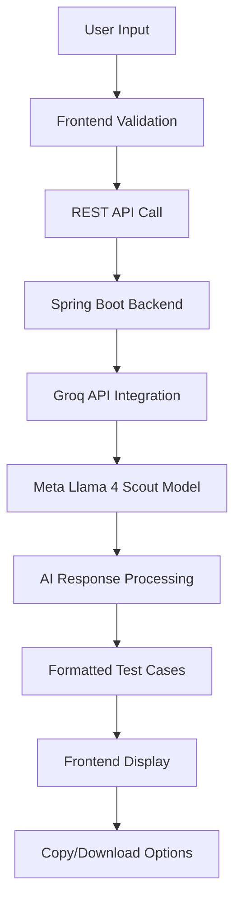
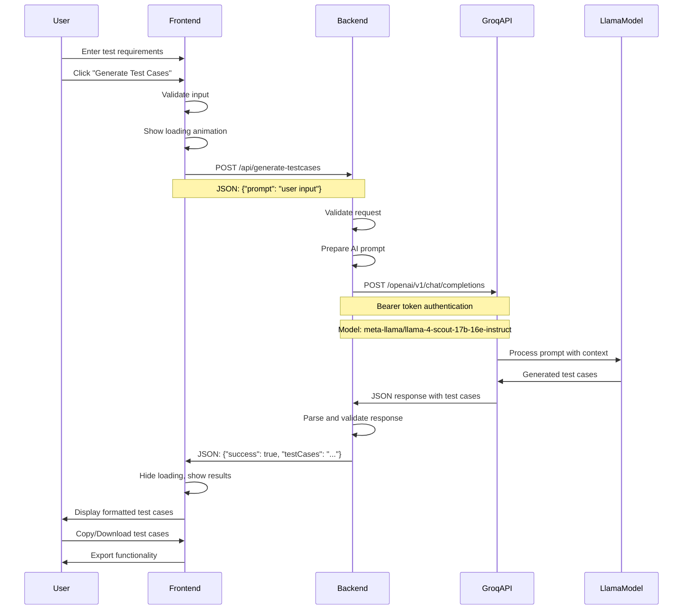

# 🤖 AI Test Case Generator - Complete Demo Application

> **Professional AI-powered test case generation using Meta Llama 4 Scout model via Groq API**  
> *Built for "Harnessing AI and Advanced Techniques for Intelligent Test Case Generation"*

[](https://www.oracle.com/java/)
[](https://spring.io/projects/spring-boot)
[](https://groq.com/)
[](https://developer.mozilla.org/en-US/docs/Web/HTML)
[](https://developer.mozilla.org/en-US/docs/Web/CSS)
[](https://developer.mozilla.org/en-US/docs/Web/JavaScript)

## Table of Contents

- [Project Overview](#-project-overview)
- [Architecture & Framework](#-architecture--framework)
- [Prerequisites](#-prerequisites)
- [Quick Start](#-quick-start)
- [Backend Setup](#-backend-setup)
- [Frontend Setup](#-frontend-setup)
- [How It Works](#-how-it-works)
- [Demo Guide](#-demo-guide)
- [API Documentation](#-api-documentation)
- [Troubleshooting](#-troubleshooting)
- [Docker Deployment](#-docker-deployment)
- [Technical Deep Dive](#-technical-deep-dive)
- [Contributing](#-contributing)

## Project Overview

The **AI Test Case Generator** is a comprehensive demo application that showcases the power of AI in software testing. Built specifically for Test Leads and QA professionals, it demonstrates how modern AI models can generate comprehensive, professional test cases from simple requirements.

### Key Features

- **Real AI Integration**: Uses Meta's Llama 4 Scout model via Groq API (not mocked)
- **UI Interface**: Presentation-ready interface designed for business demos
- **Comprehensive Test Coverage**: Generates positive, negative, edge, and boundary test cases
- **Multiple Scenarios**: Pre-built examples for different application types
- **Export Functionality**: Copy to clipboard and download generated test cases
- **Real-time Feedback**: Live connection status and generation progress
- **Error Resilience**: Comprehensive error handling and recovery

## Architecture & Framework

### Application Flow



### System Architecture

```
┌─────────────────────────────────────────────────────────────────┐
│                        Frontend Layer                          │
├─────────────────────────────────────────────────────────────────┤
│  • HTML5/CSS3/JavaScript (Vanilla)                             │
│  • Professional UI with real-time feedback                     │
│  • Responsive design for all devices                           │
│  • Toast notifications and loading animations                  │
└─────────────────────────────────────────────────────────────────┘
                                │
                                │ HTTP/JSON
                                ▼
┌─────────────────────────────────────────────────────────────────┐
│                      Backend Layer                             │
├─────────────────────────────────────────────────────────────────┤
│  • Spring Boot 3.2.0 (Java 17)                                │
│  • RESTful API endpoints                                       │
│  • CORS configuration for frontend integration                │
│  • Comprehensive error handling                               │
└─────────────────────────────────────────────────────────────────┘
                                │
                                │ HTTPS/Bearer Token
                                ▼
┌─────────────────────────────────────────────────────────────────┐
│                      AI Integration Layer                      │
├─────────────────────────────────────────────────────────────────┤
│  • Groq API (https://api.groq.com)                            │
│  • Meta Llama 4 Scout 17B-16E-Instruct                       │
│  • OpenAI-compatible API format                               │
│  • Optimised prompts for test case generation                 │
└─────────────────────────────────────────────────────────────────┘
```

### Component Structure

```
ai-testcase-generator/
├── backend/                          # Spring Boot Application
│   ├── src/main/java/com/demo/testgen/
│   │   ├── TestCaseGeneratorApplication.java    # Main Spring Boot class
│   │   ├── controller/
│   │   │   └── TestCaseController.java          # REST API endpoints
│   │   ├── service/
│   │   │   └── TestCaseService.java             # Groq API integration
│   │   └── model/
│   │       ├── TestCaseRequest.java             # Request DTO
│   │       └── TestCaseResponse.java            # Response DTO
│   ├── src/main/resources/
│   │   └── application.properties               # Configuration
│   ├── pom.xml                                  # Maven dependencies
│   └── Dockerfile                               # Container setup
└── frontend/                         # Professional Web Interface
    ├── index.html                               # Main application page
    ├── css/
    │   └── styles.css                           # Complete styling
    ├── js/
    │   └── app.js                               # Application logic
    └── README.md                                # Frontend documentation

This will have frequent updates
```

## Prerequisites

### Required Tech

- **Java 17 or higher**: [Download OpenJDK](https://openjdk.java.net/install/)
- **Maven 3.8+**: [Install Maven](https://maven.apache.org/install.html)
- **Modern Web Browser**: Chrome 70+, Firefox 65+, Safari 12+, Edge 80+
- **Internet Connection**: For Groq API access

### API Key Requirements

- **Groq API Key**: Sign up at [https://groq.com](https://groq.com) to get your API key
- Format: `gsk_v9gqY0gMgf5BWL5r8zJKWGdyb3FYBzrkOXzRTEhiEP786dI19cN2f` (example)

## Quick Start

### 5-Minute Setup

```bash
# 1. Clone/Create project structure

# 2. Set up Groq API key
export GROQ_API_KEY="your-groq-api-key-here"

# 3. Start backend (Terminal 1)
cd backend
mvn spring-boot:run

# 4. Start frontend (Terminal 2)
cd ../frontend
python -m http.server 8000

# 5. Open browser
open http://localhost:8000
```

### Verification

You should see:
- Green "Backend connected" status
- UI with example prompts
- Ability to generate real AI test cases
- Copy and download functionality working

### Backend Startup

```bash
cd backend

# Set API key
export GROQ_API_KEY="your-actual-groq-api-key"

# Build and run
mvn clean install
mvn spring-boot:run
```

**Verify Backend**: Visit `http://localhost:8080/api/health` - should return "Service is running!"

## Frontend Setup

### Frontend Startup

```bash
cd frontend

# Option 1: Python HTTP server
python -m http.server 8000

# Option 2: Node.js (if available)
npx serve .

# Option 3: Direct file access
open index.html
```

**Verify Frontend**: Visit `http://localhost:8000` - should show professional UI with green connection status.

## How It Works

### Complete Request Flow



### AI Prompt Engineering

The system uses carefully crafted prompts to ensure high-quality test case generation:

#### System Prompt (Role Definition)
```
You are an expert software test engineer with over 10 years of experience. 
Generate comprehensive, well-structured test cases based on the given 
requirements or user stories. Include positive test cases, negative test 
cases, edge cases, and boundary value testing scenarios. Format the output 
in a clear, professional structure with Test Case ID, Description, 
Preconditions, Test Steps, Expected Results, and Priority level. Make sure 
to cover all possible scenarios including security, performance, and 
usability aspects where relevant.
```

#### User Prompt Template
```
Generate detailed test cases for the following requirement: [USER_INPUT]
```

### Technical Components

#### Backend Components

1. **TestCaseController**: REST API endpoints
   - `POST /api/generate-testcases`: Main generation endpoint
   - `GET /api/health`: Health check endpoint

2. **TestCaseService**: Business logic
   - Groq API integration
   - Request/response handling
   - Error management

3. **Model Classes**: Data transfer objects
   - `TestCaseRequest`: Input structure
   - `TestCaseResponse`: Output structure

#### Frontend Components

1. **Connection Manager**: Backend connectivity
   - Real-time status monitoring
   - Automatic reconnection attempts
   - User-friendly error messages

2. **UI State Manager**: Interface control
   - Loading animations
   - Result display
   - Error handling

3. **API Integration**: Backend communication
   - RESTful API calls
   - Response processing
   - Timeout handling

### AI Model Configuration

- **Model**: `meta-llama/llama-4-scout-17b-16e-instruct`
- **Max Tokens**: 2000 (comprehensive test cases)
- **Temperature**: 0.7 (balanced creativity and consistency)
- **API Provider**: Groq (optimized for speed)
- **Authentication**: Bearer token


## API Documentation

### Endpoints

#### Health Check
```http
GET /api/health
```

**Response:**
```
Service is running!
```

#### Generate Test Cases
```http
POST /api/generate-testcases
Content-Type: application/json

{
    "prompt": "User login functionality with email and password validation"
}
```

**Success Response:**
```json
{
    "success": true,
    "message": "Test cases generated successfully",
    "testCases": "TEST CASE 1: Valid Login Credentials\nTest Case ID: TC_LOGIN_001\n..."
}
```

**Error Response:**
```json
{
    "success": false,
    "message": "Error generating test cases: API key not configured",
    "testCases": "Failed to generate test cases. Please try again."
}
```

### Authentication

The backend uses the Groq API key for authentication:
- **Environment Variable**: `GROQ_API_KEY`
- **Format**: Bearer token in Authorization header
- **Example**: `Bearer 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`

### Rate Limits

- **Groq API**: Check current limits at [https://groq.com](https://groq.com)
- **Backend**: No rate limiting implemented
- **Frontend**: 30-second timeout for generation requests

## Troubleshooting

### Common Issues and Solutions

#### 1. **Backend Won't Start**
```
Error: Could not find or load main class
```
**Solutions:**
- Verify Java 17 is installed: `java -version`
- Check Maven installation: `mvn -version`
- Clean and rebuild: `mvn clean install`

#### 2. **Connection Refused**
```
Cannot connect to backend
```
**Solutions:**
- Check backend is running on port 8080
- Verify no other service is using port 8080
- Check firewall settings

#### 3. **API Key Issues**
```
Error generating test cases: 401 Unauthorized
```
**Solutions:**
- Verify API key is set: `echo $GROQ_API_KEY`
- Check key format (should start with "gsk_")
- Ensure key is set in same terminal session as Maven

#### 4. **CORS Errors**
```
Access to fetch at 'localhost:8080' has been blocked by CORS
```
**Solutions:**
- Use HTTP server instead of file:// protocol
- Verify CORS configuration in Spring Boot
- Check the browser console for detailed error

#### 5. **Generation Timeouts**
```
 Generation timeout
```
**Solutions:**
- Check internet connection
- Verify Groq API status
- Try simpler prompts
- Increase timeout in frontend configuration

#### 6. **Port Already in Use**
```
Port 8080 is already in use
```
**Solutions:**
- Kill existing processes: `lsof -ti:8080 | xargs kill -9`
- Use a different port: `server.port=8081` in application.properties
- Update frontend API URL accordingly

### Debug Mode

#### Backend Debug Information
```bash
# Enable debug logging
export LOGGING_LEVEL_COM_DEMO_TESTGEN=DEBUG
mvn spring-boot:run
```

#### Frontend Debug Information
- Open browser developer tools (F12)
- Check Console tab for error messages
- Check Network tab for API request details
- `AppState` and `CONFIG` objects available in console (localhost only)

### Performance Issues

#### Slow Generation
- **Check**: Internet connection stability
- **Monitor**: Backend logs for API response times
- **Optimize**: Reduce prompt complexity

#### High Memory Usage
- **Check**: Java heap size settings
- **Monitor**: `jps` and `jstat` commands
- **Adjust**: JVM parameters if needed

## Docker Deployment

### Docker Files

#### Backend Dockerfile
```dockerfile
# backend/Dockerfile
FROM openjdk:17-jdk-slim

WORKDIR /app

# Install Maven
RUN apt-get update && \
    apt-get install -y maven && \
    apt-get clean && \
    rm -rf /var/lib/apt/lists/*

# Copy pom.xml first for better caching
COPY pom.xml .

# Download dependencies
RUN mvn dependency:go-offline -B

# Copy source code
COPY src ./src

# Build the application
RUN mvn clean package -DskipTests

# Expose port
EXPOSE 8080

# Set environment variables
ENV SPRING_PROFILES_ACTIVE=prod
ENV SERVER_PORT=8080

# Run the application
CMD ["java", "-jar", "target/test-case-generator-1.0.0.jar"]
```

#### Frontend Dockerfile
```dockerfile
# frontend/Dockerfile
FROM nginx:alpine

# Copy frontend files
COPY . /usr/share/nginx/html

# Copy nginx configuration
COPY nginx.conf /etc/nginx/conf.d/default.conf

EXPOSE 80

CMD ["nginx", "-g", "daemon off;"]
```

#### Docker Compose
```yaml
# docker-compose.yml
version: '3.8'

services:
  backend:
    build: ./backend
    ports:
      - "8080:8080"
    environment:
      - GROQ_API_KEY=${GROQ_API_KEY}
    healthcheck:
      test: ["CMD", "curl", "-f", "http://localhost:8080/api/health"]
      interval: 30s
      timeout: 10s
      retries: 3

  frontend:
    build: ./frontend
    ports:
      - "80:80"
    depends_on:
      - backend
    volumes:
      - ./frontend/nginx.conf:/etc/nginx/conf.d/default.conf

networks:
  default:
    name: ai-testcase-generator
```
### Configuration Management

#### Environment Variables
```bash
# Required
GROQ_API_KEY=gsk_your_actual_api_key_here

# Optional (with defaults)
SERVER_PORT=8080
GROQ_API_URL=https://api.groq.com/openai/v1/chat/completions
LOGGING_LEVEL=INFO
```

#### Application Properties Profiles
```properties
# application-dev.properties
logging.level.com.demo.testgen=DEBUG
groq.api.timeout=60000

# application-prod.properties
logging.level.root=WARN
groq.api.timeout=30000
server.compression.enabled=true
```

### Security Considerations

#### API Key Protection
- **Environment Variables**: Never hardcode in source
- **Backend Only**: API key never exposed to frontend
- **Production**: Use secrets management (AWS Secrets Manager, etc.)

#### Input Validation
- **Frontend**: Basic validation and sanitization
- **Backend**: Comprehensive validation and security checks
- **API Layer**: Prevent injection attacks

#### CORS Configuration
- **Development**: Permissive for demo purposes
- **Production**: Restrict to specific origins

### Monitoring and Observability

#### Health Checks
- **Backend**: `/api/health` endpoint
- **Frontend**: Connection status monitoring
- **Docker**: Health check configuration

#### Logging Strategy
- **Structured Logging**: JSON format for production
- **Log Levels**: DEBUG for development, INFO for production
- **Request Tracing**: Track request lifecycle

#### Metrics Collection
- **Response Times**: API call performance
- **Success Rates**: Generation success/failure ratios
- **Error Patterns**: Common error types and frequencies

## Contributing

### Development Setup

1. **Fork the repository**
2. **Create feature branch**: `git checkout -b feature/amazing-feature`
3. **Set up development environment**:
   ```bash
   # Backend
   cd backend
   mvn clean install
   
   # Frontend
   cd frontend
   npm install  # if adding npm dependencies
   ```
4. **Make your changes**
5. **Test thoroughly**
6. **Commit**: `git commit -m 'Add amazing feature'`
7. **Push**: `git push origin feature/amazing-feature`
8. **Create Pull Request**

## Conclusion

The **AI Test Case Generator** demonstrates the practical application of AI in software testing workflows. With its professional interface, real AI integration, and comprehensive feature set, it serves as an excellent example of how modern development teams can leverage AI to enhance their testing processes.

---
